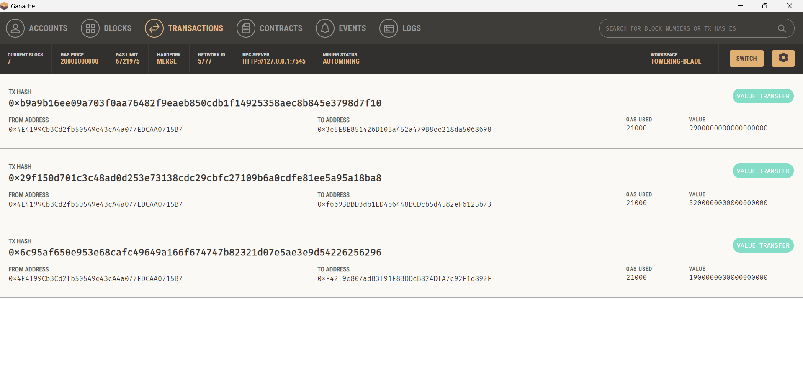
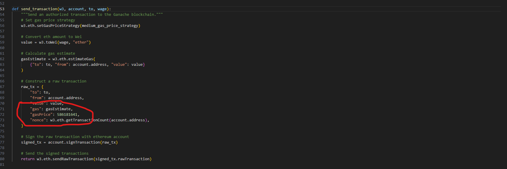

## Crypto Payments

# Summary

* The krypto_jobs python file contains the code to run an application in Streamlit. This application allows users to create a new Ethereum account, choose from available job candidates, calculate their wage based on an input of hours needed, and send payment to the job candidate in Ethereum. 

* The crypto_wallets python file contains the necessary functions for application performance. 

# Libraries

This application uses the following libraries and packages:

* Python
* Streamlit
* Ganache
* Dataclasses
* Web3
* Dotenv
* bip44

# Application Examples

- Here is a screenshot of the what the application should look like when loaded.  

- Below you will see a video clip of the application in action.

- Here is a screenshot confirming that the application connected with Ganache and the transactions were recorded to the blockchain.

# Notes for the Grader

 - I was not getting the send transaction button to work with the starter code the way it was. I was getting the error displayed below.

 

 - I was able to get the transactions to work when I changed the code gas price to a large enough number to run the small amounts for testing purposes. 

 

 _ I would love some feedback on what the issue was, since it is clearly not meant for me to need to change the sections of starter code that are already filled in. 